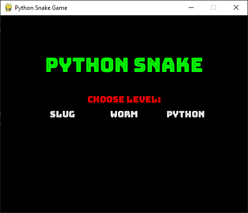
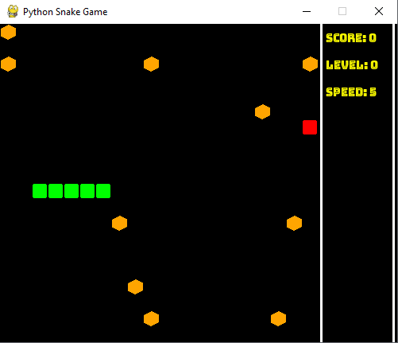

# Python Snake Game

This is a Python implementation of the classic Snake game, created using Pygame. The game features multiple levels with increasing difficulty, obstacles, and a sidebar displaying score, level, and speed.

## Course Background
This project was developed as part of the Code in Place 2024 course, a free, human-centered, intro-to-coding course offered by Stanford University. Code in Place aims to provide the highest quality free coding education to students around the world, leveraging passionate teachers, decades of experience from Stanford's CS106A course, and a supportive community of learners.

## How to Play
- Use the arrow keys to navigate the snake.
- The objective is to eat the food that appears randomly on the screen.
- Avoid running into the walls or the snake's own body.
- Progress through levels as your score increases, with new obstacles appearing and the speed increasing.

## Features
- **Multiple Levels**: The game speeds up and introduces new obstacles as you progress.
- **Obstacles**: Randomly placed obstacles that you must avoid.
- **Sidebar**: Displays your current score, level, and speed.
- **Responsive Controls**: Navigate the snake using the arrow keys.

## Requirements
- Python 3.x
- Pygame

## Installation
1. Clone the repository:
    ```bash
    git clone https://github.com/4l3k54ndr3/python-snake-game.git
    ```
2. Navigate to the project directory:
    ```bash
    cd python-snake-game
    ```
3. Install the required dependencies:
    ```bash
    pip install pygame
    ```
4. Run the game:
    ```bash
    python python_snake_game.py
    ```

## Project Structure
- `python_snake_game.py`: Main script containing the game code.
- `README.md`: This file.
- `LICENSE`: License for the project.
- `.gitignore`: Specifies files and directories to ignore in the repository.
- `requirements.txt`: List of dependencies (optional).

## Screenshots



## License
This project is licensed under the MIT License - see the [LICENSE](LICENSE) file for details.

## Credits
This game was developed as a final project for the Code in Place 2024 course at Stanford University.

### About Code in Place
Code in Place is a free, human-centered, intro-to-coding course from Stanford University. The course offers access to high-quality coding education, driven by passionate teachers and a vibrant community of learners. It covers the first half of Stanford's flagship intro to Python course, CS106A, and aims to make coding joyful and accessible to a diverse range of students.

## Project Link
[GitHub Repository](https://github.com/4l3k54ndr3/python-snake-game)
